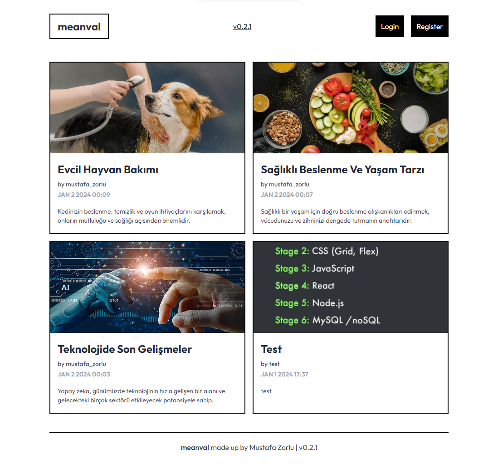
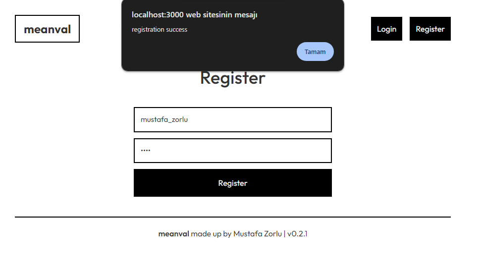
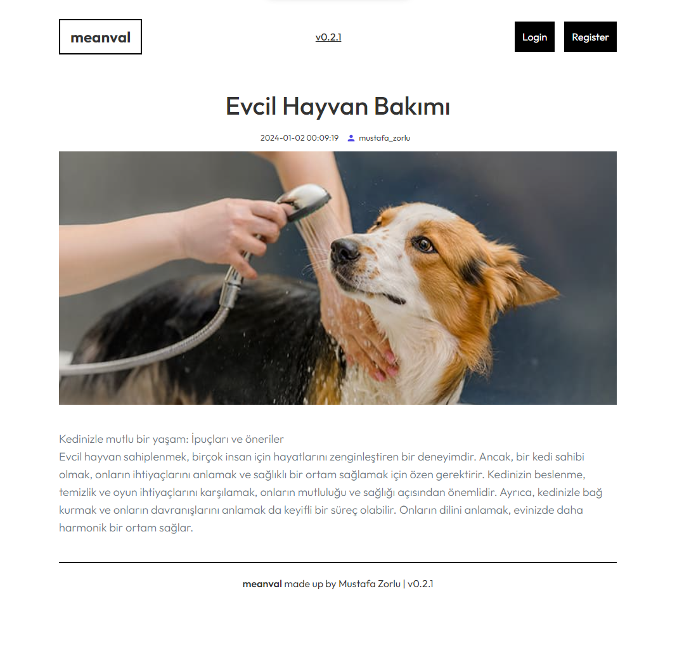

# meanval v0.2.1

 
 
Anasayfa

Kayıt Sayfası

Kayıt Sayfası

## Proje Tanımı

Bilgisayar Mühendisliği Uygulamaları 2 dersi için yaptığım blog sitesi.

Mustafa Zorlu

## Kullanılan Teknojiler

Bilgisayar Mühendisliği Uygulamaları 2 dersi için yaptığım blog sitesi.

## Projeyi Çalıştırmak İçin Yapılacak Şeyler

<b>paketleri indirmek için -> npm i</b>

<b>istemci tarafını başlatmak için -> ../client -> npm start</b>
 
<b>sunucu tarafını başlatmak için ->../api -> npm start</b>
